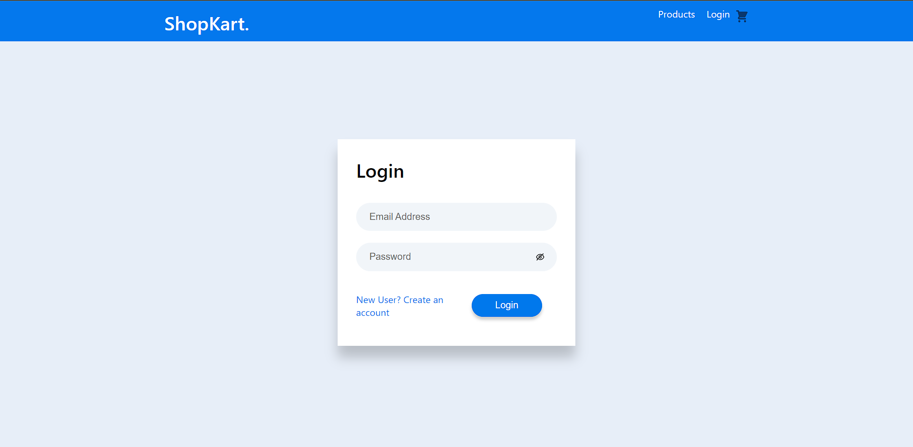
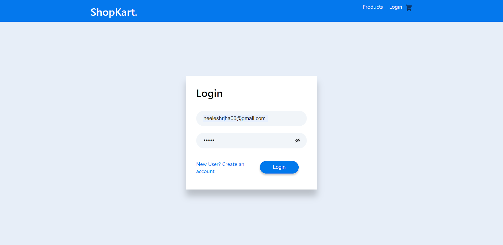
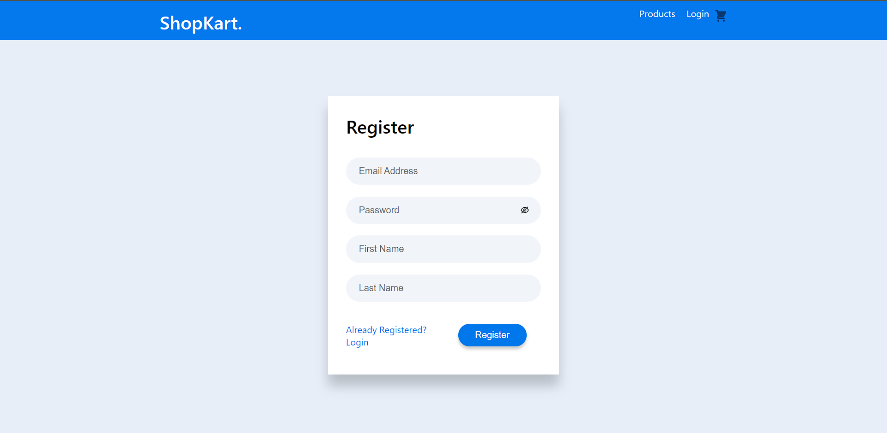
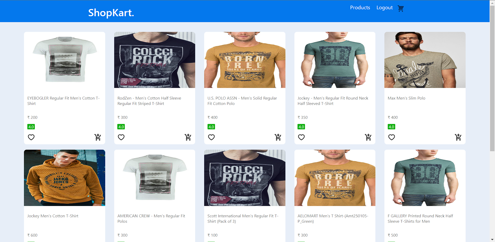
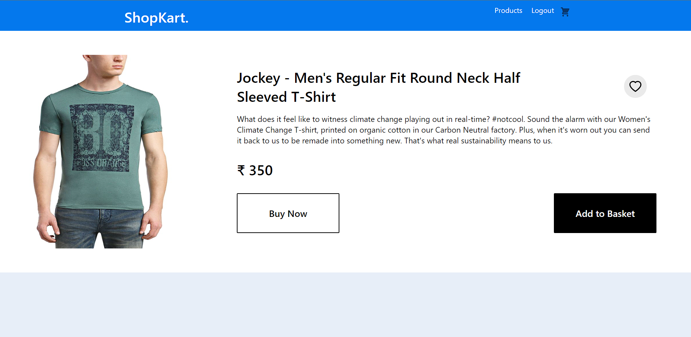
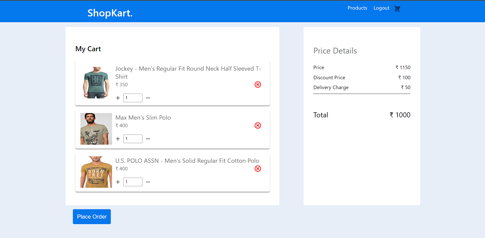
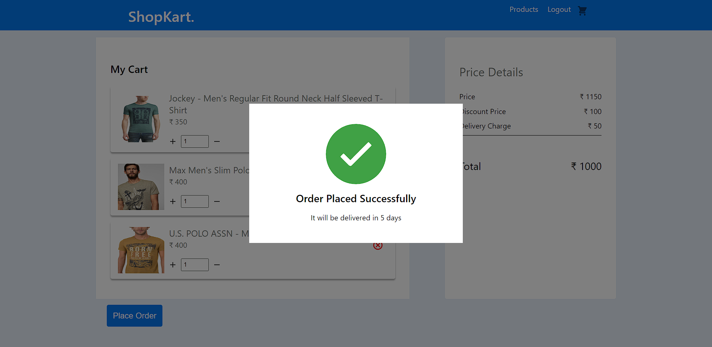

# Ecommerce (React) Coding Assessment

## Submission

### Neelesh Ranjan Jha - 19BCE1645

## Set Up

- Clone this repo
- `npm install` - To install the dependencies
- `npm run server` - To start the JSON server
- `npm start` - To start the react app

## Working
- Login/Register
- Authrization Context
- Add items to cart
- Add or remove items in cart
- Place Order
- Add items to favourites temporarily

## Not working
- Favourites synchronization with API
- Cart page + -  counter with actual value change in API

## Future Work
- Animations on button clicks
- Add to cart more interactive, just a click right now
- Dark Mode theme for full website

## User Interface

### Login/Register page

### Home page

### Product detail page

### Cart page

